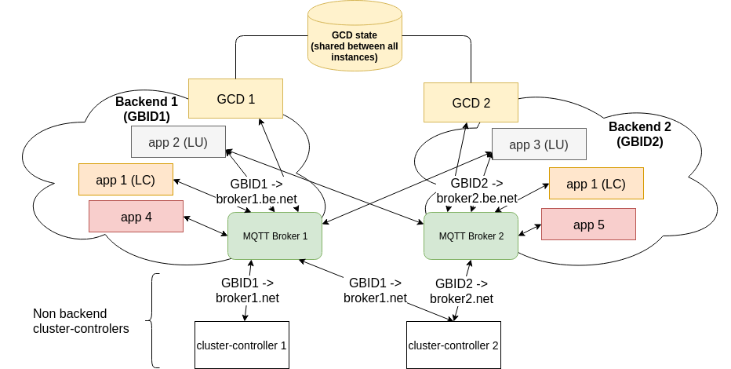

# joynr with multiple backends: Global Capabilities Directory in multiple backends

Examples and additional information for GlobalCapabilitiesDirectory.fidl version 0.2 and 0.3

## Abbreviations

* **BE**: Backend
* **CC**: ClusterController
* **DE**: DiscoveryEntry, See also **GDE** and **LDE**
* **GBID**: Global Backend IDentifier
* **GCD**: Global Capabilities (Discovery) Directory, see also **JDS**
* **GDE**: GlobalDiscoveryEntry (type name: GlobalDiscoveryEntry)
* **JDS**: Joynr Discovery Service, see also **GCD**
* **LC**: Latency Critical (application), *deployed in all BEs, connected to single Broker*
* **LCD**: LocalCapabilitiesDirectory (part of **CC**)
* **LDE**: LocalDiscoveryEntry (type name: DiscoveryEntryWithMetaInfo)
* **LU**: Latency Uncritical (application), *deployed in one BE, connected to multiple Brokers*

## Overview

## General

* **All interface changes and their implementation must be backward compatible so that old joynr
  applications (cc runtime) are able to interoperate with the new version of the GCD.**
* GCD implements the new interface version 0.3:
  [GlobalCapabilitiesDirectory.fidl](../basemodel/src/main/franca/joynr/GlobalCapabilitiesDirectory.fidl)
* The new GCD implementation replaces the old implementation:
  * The new GCD service (all instances) replaces the old GCD service (all instances)
  * Old and new joynr runtimes will use only the new GCD service.
* Each GCD instance is connected to only one Broker (one BE).
* Each GCD instance knows its own BE (GBID).
* Every BE (every GBID) has a GCD service.
* All GCD instances in all backends share the same state (e.g. database), i.e. know all participants
  of all BEs.
* A single provider instance can be registered in multiple global backends (GBIDs) using the same
 `participantId`:  
  `participantId` of providers are unique per GBID, but can be associated with many GBIDs internally.
  GDEs returned from the `lookup` methods have to be unique per participantId, see the following
  sections.
* Multiple provider instances (different joynr runtimes, running at different locations) with the
  same `participantID` can be registered in different backends (GBIDs) with different parameters.
* The reference to a GBID in the address field of GDEs is not taken into account in the `add`
  methods. It is replaced with the correct GBID, at the latest when the GDE is returned as result of
  a `lookup` method, see below.

## Interface changes between version 0.1 and version 0.2

GlobalCapabilitiesDirectory.fidl:
* Additional methods  
  *New joynr (cluster controller runtime) always uses the new methods. Thereby, GCD can easily
  distinguish between old and new versions of joynr.*
  * `lookup` methods with list of GBIDs as additional in parameter:
    * Called by new CC runtime (new joynr) with selected GBIDs or all GBIDs known to the CC runtime
      if no GBIDs were selected.
    * Providers are looked up only in the selected BEs (GBIDs).
  * `add` method for single GDE with list of GBIDs as additional in parameter:
    * Called by new CC runtime (new joynr) with selected GBIDs or default GBID if no GBIDs were
      selected.
    * Provider gets registered for the selected BEs (GBIDs).
  * `remove` method for single participantId with list of GBIDs as additional parameter:
    * Called by new CC runtime (new joynr)
    * Provider (participantId) gets removed for the selected BEs (GBIDs).
* Changed semantics of old methods
  * `lookup` methods (without GBID parameter):
    * Called by old CC runtime (old joynr).
    * Providers are looked up in the BE (GBID) of the GCD instance only (the BE in which the
      request arrived), i.e. only providers which are registered with an address of the GCD
      instance's BE are considered.
  * `add` methods (without GBID parameter):
    * Called by old CC runtime (old joynr).
    * Provider gets registered for the BE (GBID) of the GCD instance which received the add request.
  * `remove` method:
    * Called by old CC runtime (old joynr).
    * Provider (participantId) gets removed only from the backend of the GCD instance which received
      the remove request.
* Modelled errors for the new methods: see GcdErrors in
  [GlobalCapabilitiesDirectory.fidl](../basemodel/src/main/franca/joynr/GlobalCapabilitiesDirectory.fidl)

## Interface changes between version 0.2 and version 0.3
GlobalCapabilitiesDirectory.fidl:
* Additional methods
  * `removeStale` method:
    * parameters: clusterControllerId, maxLastSeenDateMs
    * Remove stale providers of a previous CC lifecycle, see below.
  * new `touch` method
    * parameters: clusterControllerId, array of participantIds
    * Update last seen date and expiry date for the list of participantIds, see below.

## Implementation details

### General

* Expired DEs and DEs with an outdated last seen date are removed, e.g. periodically, and are not
  returned as result of a lookup request.
* The last seen date of all GDEs of a CC is updated when the `touch` method is called with the
  cluster controller ID of that CC.  
  The update interval is configurable:
  * Java: see [Java Configuration Guide](../wiki/JavaSettings.md)
  * C++: SETTING_CAPABILITIES_FRESHNESS_UPDATE_INTERVAL_MS in
    [Cluster Controller settings](../cpp/libjoynrclustercontroller/ClusterControllerSettings.cpp)
* GCD returns the modelled errors (if applicable) in case of an error in the new methods (add,
  lookup, remove) instead of returning a generic ProviderRuntimeException.

### `Add` methods

* GCD stores additional information for every registered provider (`participantId`):
  * multiple addresses (GBIDs) for every provider instance (all GBIDs for which the provider has
    registered).
  * multiple GDEs per `participantId` if multiple instances of the same (fixed participantId)
    provider are registered in different BEs (GBIDs), e.g. LC provider, with different parameters
    (information stored in its GDE, lastSeenDate and address are usually different for different
    provider instances connected to different CCs)
 * **OPTIONAL (see new `lookup` methods):** store (or know) BE (GBID) of backend providers (own GBID
    of the GCD instance). The providers still have to be able to register for multiple BEs/GBIDs.
  * *The new GCD implementation could always store a separate GDE (with correct address/GBID) for
    each GBID of a participantId, even if multiple GBIDs share the same parameters (all information
    of the GDE except the address part)*
* Old `add` methods (without GBID parameter):
  * replace GBID of address in GDE parameter with the GBID of the GCD instance (own GBID), e.g. call
    the new `add` method with the own GBID
* New `add` method (with GBID parameter):
  * register provider (GDE) for all provided GBIDs (BEs)
* Add call for already registered providers (merges existing and new entries):
  * add entries for not yet registered GBIDs
  * replace entries of already registered GBIDs
  * keep existing entries for GBIDs which are not part of the new add request

### `Lookup` methods

* Always return only 1 GDE (address / GBID) per provider / participantID, selection is up to GCD
  implementation. The address field of the returned GDE contains the selected address.
* Old `lookup` methods (without GBID paramter):
  * return only GDEs registered in the own BE, i.e. GBID of the address field of the returned GDEs
    is own GBID of the GCD instance
* New `lookup` methods (with GBID parameter):
  * return only GDEs in known BEs, i.e. GBID of address in GDE is part of the GBID list argument of
    the invoked `lookup` method)
  * **OPTIONAL:** return "best" GDE (e.g. closest, fastest or cheapest connection), e.g:
    * BE provider: GDE of provider's BE if possible (if the GBID is part of the GBID list argument)
    * non BE provider: GDE of GCD instance's BE (=consumer's BE) if available (if the provider is
      registered for that BE)

### `Remove` method
* Old `remove` methods (without GBID parameter):
  * Removes the participant only from the BE of the GCD instance which received the remove request.
  * Returns without error if no matching provider is registered.
* New `remove` method (with GBID parameter):
  * Removes the provider from the selected BEs.
  * Returns error value `NO_ENTRY_FOR_PARTICIPANT` or `NO_ENTRY_FOR_SELECTED_BACKENDS` (or the other
    modeled error values) if applicable.

## Examples for the GlobalCapabilitiesDirectory interface with multiple backend scenario

### Adding providers

#### Existing `add` methods
* No signature change (no modelled errors)
* Called by old joynr versions without multiple backend support only
* Change in the behavior: GCD adds provider to its own GBID.  
  In case of Mqtt, replace the brokerUri of the MqttAddress in the received GDE.
* Example I:
  1. CC: Call `add(GlobalDiscoveryEntry)`, it contains serialized address (e.g.
    `MqttAddress(brokerUri, "sometopic")`)
  2. GCD: Replace `brokerUri` by `GBID` in the address with the GBID of the GCD instance
  3. GCD: Store modified `GlobalDiscoveryEntry` with `MqttAddress(GBID, "sometopic")`
* Example II:
  1. CC: Call `add(GlobalDiscoveryEntry[])`, each containing serialized address (e.g.
    `MqttAddress(brokerUri, "sometopic")`)
  2. GCD: Replace `brokerUri` by `GBID` in every address with the GBID of the GCD instance
  3. GCD: Store every modified `GlobalDiscoveryEntry` with `MqttAddress(GBID, "sometopic")`

#### New `add` method with GBIDs
* Signature: `add(GlobalDiscoveryEntry, GBID[])` (with modelled errors)
* Example I:
  1. CC: Call `add(GlobalDiscoveryEntry, ["GBID1", "GBID2"])`
  2. GCD: Stores GlobalDiscoveryEntry with both GBIDs, regardless of the address/GBID value that was
    sent inside the GlobalDiscoveryEntry.
* Example II:
  1. CC: Call `add(GlobalDisoveryEntry, ["GBID1"])`
  2. GCD: Stores GlobalDiscoveryEntry with GBID1, regardless of the address/GBID value that was sent
    inside the GlobalDiscoveryEntry.
* Example e-I:
  1. CC: Call `add(GlobalDisoveryEntry, [])` or `add(GlobalDisoveryEntry, [""])` or
     `add(GlobalDisoveryEntry, ["", "GBID"])`, etc.
  2. GCD: returns error value `INVALID_GBID`
* Example e-II:
  1. CC: Call `add(GlobalDisoveryEntry, ["unknownGBID"])` or
     `add(GlobalDisoveryEntry, ["GBID1", "unknownGBID"])`, etc.
  2. GCD: returns error value `UNKNOWN_GBID`

### Looking up providers

#### Existing `lookup` methods
* No signature change (no modelled errors)
* Called by old joynr versions without multiple backend support only
* Change in the behavior: GCD returns only result(s) for the GBID where the invoked GCD instance is
  located
* Example I:
  1. CC: Call `lookup([domain1, domain2], interface1)`
  2. GCD: For all `domain(1|2)` Check if `(domain(1|2), interface1)` providers are registered for
     the GBID where the invoked GCD instance is located
  3. GCD: If found - return `GlobalDiscoveryEntry`(s). No need to replace `GBID` by `brokerUri` in
     the address, as only `topic` is evaluated in CC
  4. GCD: Case not found - same behavior as now: return empty list
* Example II:
  1. CC: Call `lookup(participantId)`
  2. GCD: Check if `participantId` is registered as provider for the GBID where called GCD instance
     is located
  3. GCD: Yes (found): return `GlobalDiscoveryEntry` for `participantId`. No need to replace `GBID` by
     `brokerUri` in the address, as only `topic` is evaluated in CC
  4. GCD: No (not found): same behavior as now: return `ProviderRuntimeException`

#### New `lookup` with GBIDs
* Signatures: `lookup(domain[], interfaceName, gbid[])` and `lookup(participantId, gbid[])`
* GCD always returns only 1 GDE per provider / participantId
* Invalid and unknown GBIDs are handled like in the new `add` method (see above)
* Example I (Provider is registered in GBID1 and GBID2):
  * `lookup([domain1], interface1, [GBID1])`
    1. CC: Call `lookup([domain1], interface1, [GBID1])`
    2. GCD: Returns matching GDEs for GBID1
  * `lookup(providerParticipantId, [GBID1])`
    1. CC: Call `lookup(providerParticipantId, [GBID1])`
    2. GCD: Returns matching GDE for GBID1
  * `lookup([domain1], interface1, [GBID1, GBID2])`
    1. CC: Call `lookup([domain1], interface1, [GBID1, GBID2])`
    2. GCD: For each matching participantId: Returns GDE for one of the matching GBIDs
       * Optional GCD returns the closest, fastest connection for the given provider
  * `lookup(providerParticipantId, [GBID1, GBID2])`
    1. CC: Call `lookup(providerParticipantId, [GBID1, GBID2])`
    2. GCD: Returns GDE for one of the matching GBIDs
       * Optional GCD returns the closest, fastest connection for the given provider
* Example II (Provider is registered in GBID2):
  * `lookup([domain1], interface1, [GBID1])`
    1. CC: Call `lookup([domain1], interface1, [GBID1])`
    2. GCD: Nothing found for GBID1: returns error value `NO_ENTRY_FOR_SELECTED_BACKENDS`
  * `lookup(providerParticipantId, [GBID1])`
    1. CC: Call `lookup(providerParticipantId, [GBID1])`
    2. GCD: Nothing found for GBID1: returns error value `NO_ENTRY_FOR_SELECTED_BACKENDS`
* Example III (Provider is not registered):
  * `lookup([domain1], interface1, [GBID1])`
    1. CC: Call `lookup([domain1], interface1, [GBID1])`
    2. GCD: Nothing found for any GBID: returns empty list
  * `lookup(providerParticipantId, [GBID1])`
    1. CC: Call `lookup(providerParticipantId, [GBID1])`
    2. GCD: Nothing found for GBID1: returns error value `NO_ENTRY_FOR_PARTICIPANT`

### Removing providers

#### Existing `remove` methods
* No signature change
* Change in the behavior: remove `participantId` only for GBID where the invoked GCD instance is
  located
* Example I (`remove([participantId1, participantId2])`):
  1. CC: Call `remove([participantId1, participantId2])`
  2. GCD: Find all `GlobalDiscoveryEntry` with `participantId1` or `participantId2` and the GBID of
     the BE where the invoked GCD instance is located
  3. GCD: Remove all found `GlobalDiscoveryEntry`
* Example II (`remove(participantId1)`)
  1. CC: Call `remove(participantId1)`
  2. GCD: Find all `GlobalDiscoveryEntry` with `participantId1` and the GBID of the BE where the
     invoked GCD instance is located
  3. GCD: Remove all found `GlobalDiscoveryEntry`

#### New `remove` method
* Signature: `remove(participantId, gbids[])`
* Invalid and unknown GBIDs are handled like in the new `add`method (see above)
* Example I (Provider is registered in GBID1):
  * `remove(participantId1, [GBID1])`
    1. CC: Call `remove(participantId1, [GBID1])`
    2. GCD: Remove provider with `participantId1` from GBID1
  * `remove(participantId1, [GBID2])` and `remove(participantId1, [GBID1, GBID2])`
    1. CC: Call `remove(participantId1, [GBID2])` or `remove(participantId1, [GBID1, GBID2])`
    2. GCD: Nothing found for GBID: returns error value `NO_ENTRY_FOR_SELECTED_BACKENDS`
* Example II (Provider is registered in GBID1 and GBID2):
  * `remove(participantId1, [GBID1])`
    1. CC: Call `remove(participantId1, [GBID1])`
    2. GCD: Remove provider with `participantId1` from GBID1
  * `remove(participantId1, [GBID1, GBID2])`
    1. CC: Call `remove(participantId1, [GBID1, GBID2])`
    2. GCD: Remove provider with `participantId1` from GBID1 and GBID2
* Example III (Provider is not registered):
  1. CC: Call `remove(participantId1, [GBID1])`
  2. GCD: Nothing found for GBID1: returns error value `NO_ENTRY_FOR_PARTICIPANT`

#### New `removeStale` method (introduced in interface version 0.3)
  * Signature: `removeStale(clusterControllerId, maxLastSeenDateMs)`
  * Unregisters stale providers of a specific cluster controller which have been registered in a
    previous cluster controller lifecycle from all backends. Only providers with a lower last seen
    date than the provided maximum last seen date shall be removed.

### `Touch`

#### Existing `touch` method
* No change in signature
* Update the last seen date of all registrations for all GBIDs of the given clusterControllerId  
  (The clusterControllerId is part of the address of a GDE, in case of an MqttAddress, it is part
  of the topic)

#### New `touch` method (introduced in interface version 0.3)
  * Signature: `touch(clusterControllerId, participantIds[])`
  * Update the expiry date of the GlobalDiscoveryEntries of a specific cluster controller
    (in all backends) which correspond to the provided list of participant Ids.
  * The last seen date will be set to the time of the touch call ('now'), the expiry date will be
    extended, i.e. it will be set to 'now + N', where N is the configured default
    provider / discovery entry expiry interval (6 weeks by default)
