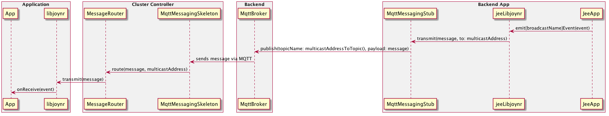

# Stateless Broadcasts Concept: aka multicast

## Overview

Standard joynr messages are addressed point-to-point, meaning that each joynr
message is addressed to an individual participantId. This addressing paradigm is
well suited to RPC, but in the case of pub/sub and broadcast publications, it
requires the provider process to statefully keep a list of subscribers to which
a publication are to be addressed.

joynr is now introducing multicast joynr messages, defined as a message sent to
a MulticastId. A single message sent to a MulticastId can be received
by 1 to n subscribers to that MulticastId. When used to transmit
publications, MulticastIds allow JEE providers to remain stateless: the
provider no longer has to keep track of listeners to the subscription, but
rather sends directly to the MulticastId. In addition, since only a single
publication message now has to be sent between a provider and its message
broker, MulticastIds reduce bandwidth use for large sets of subscribers.

The introduction of MulticastIds does not break the joynr APIs for
Consumers subscribing/unsubscribing to/from a broadcast; however, the joynr APIs of
joynr Java and joynr C++ for updating subscriptions now expect the subscriptionId as
first parameter. The API for subscribing to a broadcast has been extended for those
applications wanting to use partitions. All other changes will be performed at the
Dispatching (Subscription/PublicationManager) and Messaging (Message Router /
Messaging Skeleton) layers only.

## Technical Details

### MulticastId
* A MulticastId is a composite of the provider's participantId, the name of
  the broadcast as modelled in Franca IDL, and an optional partition.
* A partition is a list of strings that represent a hierarchy similar to a URL
  path or an MQTT (sub)topic. See the section on partitions for more information.
  A MulticastId can thus be calculated from information available to the
  consumer at discovery.

### Partitions
A partition allows finer control of whom should receive a given multicast message. A single
broadcast can thus be modeled in Franca. At runtime, consumers can subscribe for a subset
of all publications being sent. The fireBroadcast method called by the provider allows the provider
to state which partition the broadcast is for.

#### Partition Syntax and Wildcards
* A partition segment is case-sensitive.
* A partition segment may only contain alphanumeric characters: A-Z, a-z and 0-9.
* Subscribers may use the + character to wildcard a single level partition segment.
  Example: subscribing to a/+/c will be notified for a/b/c and a/a/c but not for a/b/d or a/b/c/d.
* Subscribers may end a partition sequence with the multi-level wildcard \*, which matches any
  number of sub-partitions below the wildcard.
  Example: subscribing to a/b/* will be notified for a/b/c, a/b/d and a/b/c/d, but not for a/c/d.
* Providers must not use wildcards in partitions when firing a broadcast.

### Registering to receive multicast messages
When an application subscribes to a broadcast, its libjoynr calls
registerMulticastReceiver with the MulticastId, the receiver's own participantId,
and the provider's participantId.

The cluster controller's Message Router records this information in the
RoutingTable.

The MulticastId is then passed on to the Messaging Skeleton responsible for the
provider's address corresponding to its participantId found in the MulticastId.

* For MQTT (providers registered via MQTT), the Messaging Skeleton then subscribes
  to a topic equal to {provider's participantId}/{broadcastName}/
  {partition elements separated by "/"}.
  A subscriber counter in the Messaging Skeleton in the cluster-controller keeps
  track of how many subcribers there are on the given MulticastId.
* For Channel (providers registerd via HTTP) (NOT IMPLEMETED YET), the same concept
  applies, with the skeleton making a new long-poll request to a channelId equal to
  {provider's participantId}{broadcastName}{concatenation of partition elements}.
* For WebSocket and InProcess providers, the multicast subscriber is registered
  in the cluster controller's Message Router only.

### Sending a multicast message
All non-selective broadcasts will be sent via joynr multicast messages.
Attribute subscriptions and selective broadcasts will still be sent as
unicast publication message for now.

When the providing application emits a broadcast, the publication is addressed
to the given MulticastId and passed on to the Message Router. No
information about subscribed consumers is required on the provider side.

The Message Router passes the message containing the MulticastId to all
stubs registered on the given MulticastId.

The libjoynr's Message Router additionally transmits the message to its cluster
controller via the WebSocket Messaging Stub.

The cluster controller's message router also publishes the message via its primary
global transport to reach all subscribers which are connected to other cluster
controllers:

* The MQTT Messaging Stub publishes the message to an MQTT topic equal to
  {provider's participantId}/{broadcastName}/{partition elements separated "/"}.

* The ChannelMessagingStub must POST the message to a channel equal to
  {provider's participantId}{broadcastName}{concatenation of partition elements}.

### Receiving a multicast message
Incoming messages are passed from the receiving messaging skeleton to the
MessageRouter. The MessageRouter uses the information in the RoutingTable to
multicast the message on all messaging stubs that are registered as receivers on
the given MulticastId.

#### Prevent infinite echo publication
Because the broadcast messages are sent to a MulticastId rather than
individual participants, the problem for the cluster controller is knowing
whether the message being processed is intended for initial global publication,
or was just received from an outside provider. If it can't make this distinction
it would publish it out to the MQTT broker, just to receive it back again, etc.
etc. etc.

In order to prevent this from happening, a new transient attribute in the joynr message
which will be set when the message has been received via global transport.
It then won't be serialised for transmission, hence if a message arrives with the transient flag
set to TRUE, it means that it was received for distribution to the registered listeners only,
but not for global publication.

### Issues
* As Providers became stateless, the publication ttl included in the OnChangeSubscription
  is currently not being used by the provider. Possible alternatives to overcome this limitation are
  being considered.

