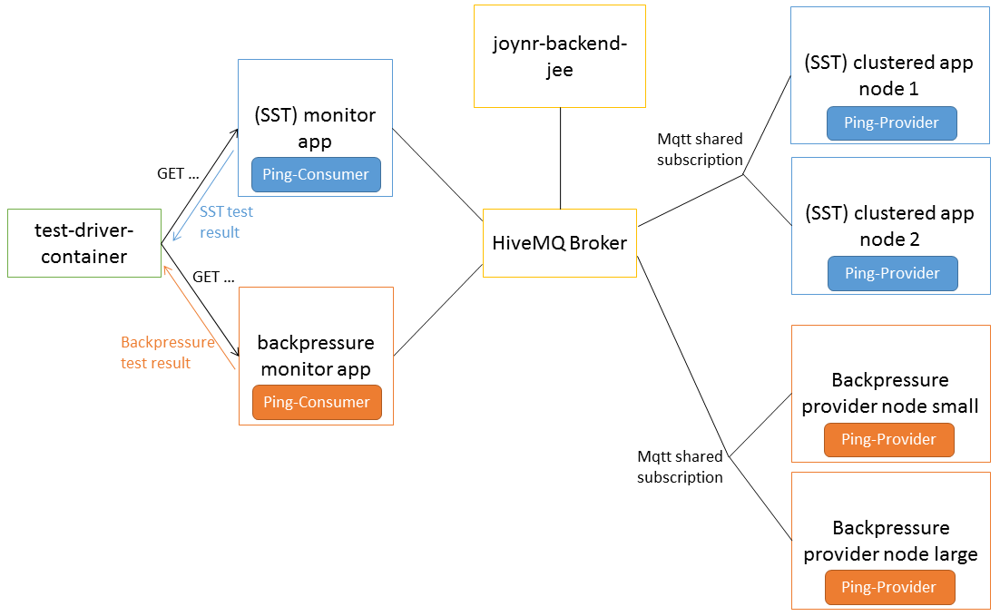

# Integration tests based on MQTT Shared Subscriptions

These tests are based on a docker orchestra. For an overview of the involved containers see:

## Shared Subscriptions Test
Per MQTT Version 3 specification, all MQTT clients subscribed to a given topic will receive all
publications to that topic. This standard behavior prevents horizontal scaling of MQTT clients in
a cluster environment: no matter how many nodes are added to the cluster, all nodes will receive
the full message load.

HiveMQ offers a proprietary feature called Shared Subscriptions, meant for use by clustered MQTT
clients. Shared Subscriptions ensure that each message is received by only one MQTT client that is
part of a given group (as identified by a group id).

Joynr supports HiveMQ Shared Subscriptions as a clustering solution for JEE applications
using joynr JEE integration with MQTT for incoming communication, allowing joynr JEE applications
to scale horizontally in a JEE cluster.

This test setup creates a set of Docker containers using
docker-compose comprising:
* a (mini) JEE cluster offering a joynr provider
* a single node monitoring application (joynr proxy, also JEE) which communicates with the
cluster
* a test driver (REST-API caller) triggering the monitoring application and receiving the test result
* a HiveMQ broker for the MQTT communication.
* joynr backend services (discovery directory etc.) connected with the broker

## Backpressure Test
The backpressure test checks that nodes in a shared subscriptions cluster can unsubscribe in case of
heavy load situations and subscribe again when they successfully process queued requests. For more details
on the backpressure mechanism please see:
https://github.com/bmwcarit/joynr/blob/master/wiki/JavaSettings.md#limitandbackpressuresettings.

This test setup creates a set of Docker containers using
docker-compose comprising:
* a (mini) JEE cluster offering a joynr provider and set up with backpressure mechanism turned on
* a single node monitoring application (joynr proxy, also JEE) which communicates with the
cluster and which produces a heavy-load situation
* this test reuses the test driver, the broker and the joynr backend services mentioned above

## Pre-requisites

You must have a version of docker installed `>=1.13`, and
a matching version of `docker-compose`.

You must be able to install the required infrastructure Docker Images
in your local repository (see below for which ones are required).

## Building

### Prerequisite

The joynr backend docker images `joynr-gcd-db` and `joynr-gcd` are required to run the tests.

You can build them by running `cd <joynr_repo>/docker/ && ./build_backend.sh`.

### Test docker images

The easiest way to build all necessary images is to execute the

`./build_all.sh`

script in this directory.

Alternatively, build the required docker images by changing into the following
directories and executing the './build_docker_image.sh' scripts inside:

`test-apps/backpressure-clustered-provider-large/`
`test-apps/backpressure-clustered-provider-small/`
`test-apps/backpressure-monitor-app/`
`test-apps/clustered-app/`
`test-apps/monitor-app/`
`test-driver-container`

(if you are on a Unix-like OS, otherwise, check to see what the script
does and make the appropriate changes for your OS)

You should now see the appropriate Docker Images:

    localhost> $ docker images
    REPOSITORY                                   TAG      IMAGE ID       CREATED        SIZE
    test-driver-container                        latest   7b24c01f99fd   6 days ago     231MB
    shared-subs-test-monitor-app                 latest   0ded26ec8cc7   6 days ago     1.27GB
    shared-subs-test-clustered-app               latest   6528b5fd9ad6   6 days ago     1.27GB
    backpressure-test-monitor-app                latest   9863d9cf8cf6   6 days ago     1.27GB
    backpressure-test-clustered-provider-small   latest   cd240788b955   6 days ago     1.27GB
    backpressure-test-clustered-provider-large   latest   99dabb10e9d6   6 days ago     1.27GB
    joynr-gcd                                    latest   7948363be5d6   15 hours ago   261MB
    joynr-gcd-db                                 latest   8a2e8fa2c8cc   15 hours ago   192MB
    hivemq/hivemq-ce                             latest   a03634593620   2 months ago   392MB

The HiveMQ 4 Docker image will be downloaded automatically when running the tests.

## Running

To run the tests, change to this directory
(`${project_root}/docker/joynr-hivemq-shared-subscriptions`) and
execute:

`docker-compose up -d`

To follow along with the progress:

`docker-compose logs -f`

You can also start the test using the `run_tests.sh` script. In this case the
output is stored into a (large) log file at the end of the test run.

When all containers have started up, the test-driver will automatically
trigger a test of the shared subscriptions using a REST-API call. If everything is successful
you should see the following log output (which you could grep for, e.g.
`docker-compose logs -f | grep -C1 'Triggered 100 pings.'`)
from the test-driver:

        Triggered 100 pings. 100 were successful, 0 failed. 00a0eaef1e02: 50 c7cb1f96d6c2: 50
        [SharedSubsTest] SUCCESS

Note that the IDs at the end of the first line will change for each run
as these are the randomly generated unique IDs of the two docker containers
running the clustered application.

In the case of a failure, you will find `[SharedSubsTest] FAILURE` in the log.

After the shared subscriptions tests the test-driver will trigger the backpressure test. The output
of the test result is following the same format as above, i.e. `[BackpressureTest] SUCCESS/FAILURE` as
well as more details on the issues ping requests.

### Manual tests

If you want to trigger any further tests manually, then connect to one of
the both monitoring containers. See what its ID is by executing `docker ps`, and
copy the unique ID. Then execute:

`docker exec -it <container ID> bash`

From within the container, you can now e.g. trigger a small SST:

`curl http://localhost:8080/monitor-app/test/10`

This will make 10 calls to the clustered application and then report
how many calls were made, how many successfully, how many in error and
which node handled how many of the successful ones (you should see an
even 50:50 split if everything is working).

Next, you can check that the replies from a node in the cluster to a
joynr provider outside of the cluster are arriving back at the correct
cluster node:

`curl http://clustered-app-node-1:8080/clustered-app/ping/5`

This previous example will perform 5 calls in a row from the first
cluster node to the monitor app, and dump out a list of results / errors.
You should see a list of five machine IDs which are all equal (the ID
of the Docker Container running the monitoring application).

## How to stop

To stop the scenario, `exit` the container you connected to and then
run the following commands:

`docker-compose stop`

`docker-compose rm -f`

In case you are executing the `run_tests.sh` script no action is needed
as the docker orchestra is stopped automatically.
