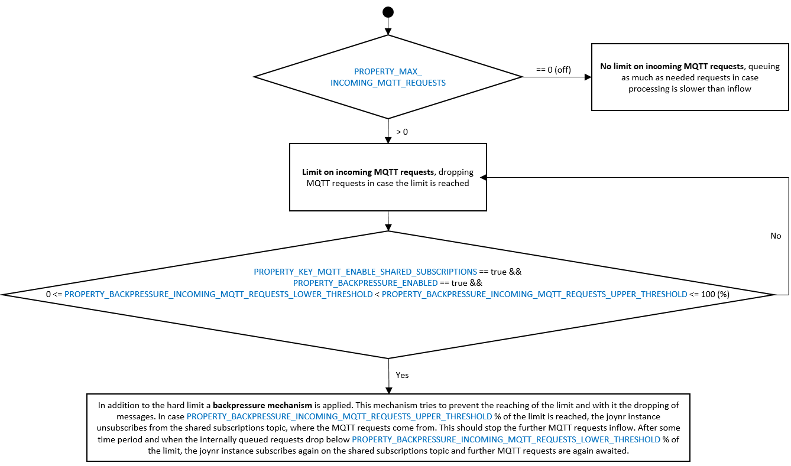
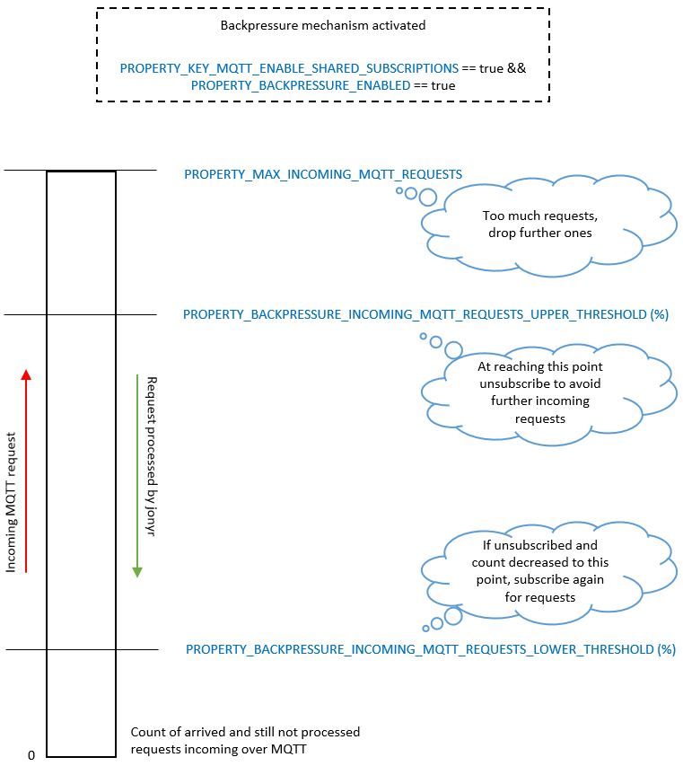

# Joynr Java Settings

The following describes which settings can be made in Java, either by:

1. Default settings file (provided by joynr)
2. Properties file (persisted properties)
3. Programmatically
4. OS environment settings
5. Java System settings

**Defaults:**
All defaults are set in defaultMessaging.properties and defaultServletMessaging.properties. The
properties that must be overriden for a normal deployment (assuming you are not just testing on
localhost) are marked below as REQUIRED.

**Precedence:**
*Java system settings* take precedence over *OS enviromnent settings* and so on (see order above).

**OS environment settings:**
Since `.` is not allowed in OS environment settings, every `.` in the property key has to be replaced
by a `_` when used in OS environment settings. E.g.: `joynr_messaging_mqtt_brokeruris`instead of
`joynr.messaging.mqtt.brokeruris`.

**Examples**

1. Default settings file:
Cannot be modified (shipped with joynr).

2. Properties file (persistence file):
Add property to a joynr persistence file (paths of persistence files can be configured):
```
...
joynr.setting.key=value
...
```
Persistence files are loaded automatically when the joynr runtime is created.

3. Programmatically:
Add property to the joynrConfig before the joynr runtime is created;
```
...
Properties joynrConfig = new Properties();
joynrConfig.setProperty(joynr.setting.key, value);
...
```
See also [Java guide](java.md#the-main-method), [JEE guide](jee.md#application-configuration).

4. OS environment settings:
Add environment variable `joynr_settings_key` with value `value`.
Every `.` in the property's key has to be replaced by a `_`.

5. Java System settings:
When running a java standalone application (e.g. example.jar), use `-D` to set system properties:
```
java -Djoynr.settings.key=value -jar example.jar
```

## ConfigurableMessagingSettings

### `CHANNELID`
When shared subscriptions are enabled for MQTT the channel ID identifies the cluster. Each node of the
cluster must use the same value. If no channel ID is specified a random UUID will be used as
the channel ID.

### `RECEIVERID`
When shared subscriptions are enabled for MQTT the receiver ID identifies a node within a cluster.
If no receiver ID is specified a random UUID will be used as the receiver ID.

### `PROPERTY_KEY_MQTT_SEPARATE_CONNECTIONS`
This property allows establishing two mqtt connections in parallel. One is used
for publishing and one for subscribing. This can be used to enhance throughput.

* **OPTIONAL**
* **Type**: String
* **User property**: `joynr.messaging.mqtt.separateconnections`
* **Default value**: `false`

### `PROPERTY_DISCOVERY_DEFAULT_TIMEOUT_MS`
When a proxy is built, the max. duration of the arbitration process can be limited
by setting the discoveryTimeoutMs attribute of a DiscoveryQos object that is
then passed to the proxy builder. If no discovery timeout is specified this way,
the default value will be read from this property.

* **OPTIONAL**
* **Type**: long
* **User property**: `joynr.discovery.defaultTimeoutMs`
* **Unit**: milliseconds
* **Default value**: `600000`

### `PROPERTY_DISCOVERY_DEFAULT_RETRY_INTERVAL_MS`
If a proxy is built and the corresponding provider cannot be found immediately, the lookup on the
capabilities directory will be repeated after a certain time interval. The length of this interval
can be specified by setting the retryIntervalMs attribute of a DiscoveryQos object that is then
passed to the proxy builder. If no retry interval is specified this way, the default value will be
read from this property. See also
[`PROPERTY_DISCOVERY_MINIMUM_RETRY_INTERVAL_MS`](#property_discovery_minimum_retry_interval_ms).

* **OPTIONAL**
* **Type**: long
* **User property**: `joynr.discovery.defaultRetryIntervalMs`
* **Unit**: milliseconds
* **Default value**: `10000`

### `PROPERTY_DISCOVERY_MINIMUM_RETRY_INTERVAL_MS`
Minimum value for DiscoveryQos.retryIntervalMs, see
[`PROPERTY_DISCOVERY_DEFAULT_RETRY_INTERVAL_MS`](#property_discovery_default_retry_interval_ms).
The minimum will be applied automatically if the provided value is smaller.

* **OPTIONAL**
* **Type**: long
* **User property**: `joynr.discovery.minimumRetryIntervalMs`
* **Unit**: milliseconds
* **Default value**: `2000`

### `PROPERTY_DISCOVERY_PROVIDER_DEFAULT_EXPIRY_TIME_MS`
If a provider is registered, its expiry date will be set to 'now + N'. N is
the value of this property.

* **OPTIONAL**
* **Type**: int
* **User property**: `joynr.discovery.provider.defaultexpirytimems`
* **Unit**: milliseconds
* **Default value**: `3628800000 (6 weeks)`

### `PROPERTY_DISCOVERY_GLOBAL_ADD_AND_REMOVE_TTL_MS`
TTL used for adding and removing global discovery entries.

* **OPTIONAL**
* **Type**: long
* **User property**: `joynr.discovery.globaladdandremovettlms`
* **Default value**: `2592000000` (30 days)

### `PROPERTY_HOSTS_FILENAME`
File used by the HTTP messaging stub to map URLs. It uses the Java properties file format. The key
of an entry identifies a hostname that must be replaced in a URL. The value of an entry consists of
up to four compoments separated by a colon:

1. replacement host name,
2. replacement port,
3. path search term and
4. replacement path.

```
hostname-to-replace=host-replacement:port-replacement:path-search-term:path-replacement
```

This entry will apply to all URLs with hostname `hostname-to-replace`. The original hostname and
port are replaced by `host-replacement` and `port-replacement`, respectively. Furthermore, the
original path is searched for `path-search-term` and the first occurance is replaced by
`path-replacement`.

* **OPTIONAL**
* **Type**: String
* **User property**: `joynr.messaging.hostsFileName`
* **Default value**: `hosts.properties`

### `PROPERTY_MAX_MESSAGE_SIZE`
The maximum length of a text message the WebSocket transport is able to send/receive.

* **OPTIONAL**
* **Type**: int
* **User property**: `joynr.messaging.maxmessagesize`
* **Default value**: `4000000`

### `PROPERTY_MESSAGING_MAXIMUM_PARALLEL_SENDS`
The number of threads used by the message router to send joynr messages.

* **OPTIONAL**
* **Type**: int
* **User property**: `joynr.messaging.maximumparallelsends`
* **Default value**: `20`

### `PROPERTY_MESSAGING_MAXIMUM_TTL_MS`
The maximum allowed time-to-live (TTL) of joynr messages. The TTL used in a joynr message is set on
the proxy builder using the messaging QoS object. These TTLs are only accepted up to the maximum
value defined by this property.

* **OPTIONAL**
* **Type**: long
* **User property**: `joynr.messaging.maxttlms`
* **Default value**: `2592000000` (30 days)

### `PROPERTY_ROUTING_TABLE_GRACE_PERIOD_MS`
A routing table entry has an expiry date; once this point in time has been passed, the entry can
be removed from the routing table. The expiryDateMs is calculated or updated based on the message
ttls plus this grace period in milliseconds.

* **OPTIONAL**
* **Type**: long
* **User property**: `joynr.messaging.routingtablegraceperiodms`
* **Default value**: `30000`

### `PROPERTY_ROUTING_TABLE_CLEANUP_INTERVAL_MS`
The number of milliseconds between two consecutive invocations of the routing table cleanup

* **OPTIONAL**
* **Type**: long
* **User property**: `joynr.messaging.routingtablecleanupintervalms`
* **Default value**: `60000`

### `PROPERTY_SEND_MSG_RETRY_INTERVAL_MS`
The message router sends joynr messages through different messaging middlewares (WebSockets, HTTP,
MQTT, ...) using middleware-specific messaging stubs. On transmission errors the message router
initiates a retransmission.

If the messaging stub does not provide information on when to retry message transmission, the
message router will use the send message retry interval defined by this property to delay the
message transmission and start a new transmission attempt. Multiple unsuccessful retransmission
attempts will add an additional exponential backoff to delay message transmission.

The maximum delay between such retransmission attempts can be configured with
`PROPERTY_MAX_DELAY_WITH_EXPONENTIAL_BACKOFF_MS`.

The message router tries to resend a message until its TTL expires or the maximum number of retries
is reached, see `PROPERTY_ROUTING_MAX_RETRY_COUNT`.

* **OPTIONAL**
* **Type**: long
* **User property**: `joynr.messaging.sendmsgretryintervalms`
* **Default value**: `3000`

### `PROPERTY_ROUTING_MAX_RETRY_COUNT`
The message router sends joynr messages through different messaging middlewares (WebSockets, HTTP,
MQTT, ...) using middleware-specific messaging stubs. On transmission errors the message router
initiates a retransmission until the message's TTL expires.

If `PROPERTY_ROUTING_MAX_RETRY_COUNT` is set, this value is used as upper bound on the number of
send retries. If either the message's TTL expires or the maximum number of retries is reached, no
further retransmission attempts are initiated and the message is dropped with an error log message.

* **OPTIONAL**
* **Type**: long
* **User property**: `joynr.messaging.routingmaxretrycount`
* **Default value**: `-1` (retry count is not taken into account)

### `PROPERTY_MAX_DELAY_WITH_EXPONENTIAL_BACKOFF_MS`
The message router sends joynr messages through different messaging middlewares (WebSockets, HTTP,
MQTT, ...) using middleware-specific messaging stubs. On transmission errors the message router
initiates a retransmission until the message's TTL expires.
The time till the next retransmission increases exponentially with each unsuccessful retransmission.

The maximum time can be limited by setting `PROPERTY_MAX_DELAY_WITH_EXPONENTIAL_BACKOFF_MS`.
Please make sure to set a value higher than `PROPERTY_SEND_MSG_RETRY_INTERVAL_MS`.

If `PROPERTY_MAX_DELAY_WITH_EXPONENTIAL_BACKOFF_MS` is set, this value is used as upper bound
for the added time to the retry interval by the exponential backoff algorithm.

* **OPTIONAL**
* **Type**: long
* **User property**: `joynr.messaging.maxDelayWithExponentialBackoffMs`
* **Default value**: `-1` (no maximum delay for retry interval)

### `PROPERTY_CAPABILITIES_FRESHNESS_UPDATE_INTERVAL_MS`

The cluster controller sends a freshness update message to the global discovery directory every
PROPERTY_CAPABILITIES_FRESHNESS_UPDATE_INTERVAL_MS milliseconds. The global discovery directory
updates the ```lastSeenDateMs``` of all capabilities registered via this cluster controller.

* **OPTIONAL**
* **Type**: long
* **User property**: `joynr.capabilities.freshnessupdateintervalms`
* **Default value**: `3600000`

### `PROPERTY_GBIDS`

The GBIDs (Global Backend IDentifiers) of the backends for the cluster controller to connect to.
A GBID identifies a single backend independently of its address. This is necessary for multiple
backends, since the URI/URL of a backend can differ depending on external circumstances. In case of
MQTT, a backend (GBID) consists of all joynr participants (consumers and providers) which are
connected to the same MQTT broker, i.e. all participants that can be reached via this broker.

The first defined GBID is used as default for the global capabilities directory and provider registration.
The GBIDs are mapped to transport specific URLs. In case of MQTT, a Broker-Uri has to be defined for each
GBID in the Property MqttModule.PROPERTY_MQTT_BROKER_URIS.

Currently, only MQTT is supported for multiple backends.

This property has to be provided as one line where the GBIDs are separated by commas. This also means that
',' is an invalid character for a GBID.

* **REQUIRED for cluster controller runtime with enabled global transport.**
* **Type**: String
* **User property**: `joynr.messaging.gbids`
* **Default value**: `joynrdefaultgbid`

### Persistence settings

#### `PROPERTY_PARTICIPANTIDS_PERSISTENCE_FILE`
If the file based participant ID storage (`PropertiesFileParticipantIdStorage`) is used, participant
IDs of registered providers are persisted to this file and reused for further registrations to the
same interface and domain combination.

* **OPTIONAL**
* **Type**: String
* **User property**: `joynr.discovery.participantids_persistence_file`
* **Default value**: `joynr_participantIds.properties`

#### `PROPERTY_SUBSCRIPTIONREQUESTS_PERSISTENCE_FILE`
If the file based subscription request storage (`FileSubscriptionRequestStorage`) is used,
then subscription requests for attributes and filtered (=selective) broadcasts are persisted
to this file provided subscription requests persistency is enabled
(see `PROPERTY_SUBSCRIPTIONREQUESTS_PERSISTENCY`).

* **OPTIONAL**
* **Type**: String
* **User property**: `joynr.dispatching.subscription.subscriptionrequests_persistence_file`
* **Default value**: `joynr_persistedSubscriptionRequests`

#### `PROPERTY_SUBSCRIPTIONREQUESTS_PERSISTENCY`
Controls whether subscriptions for filtered (=selective) broadcasts and attributes
will be persisted. Needs to be `true` if a provider after restart should be able to
continue sending publications for those subscriptions established before the restart.
For this to work, the routing entries from routing table must be persisted as well.
Note that unfiltered (=non-selective) broadcasts (=multicasts) are not affected by
this setting since they are published on a 1:n base and thus need no persistency.

* **OPTIONAL**
* **Type**: Boolean
* **User property**: `joynr.dispatching.subscription.subscriptionrequests_persistency`
* **Default value**: `true`

### Properties to override the DiscoveryEntries of the joynr backend services

The following properties can be used to override the provisioned DiscoveryEntries for
`GlobalCapabilitiesDirectory` (GCD) and `GlobalDomainAccessController` (GDAC) without providing a
provisioning file for all required DiscoveryEntries (see section
`PROPERTY_PROVISIONED_CAPABILITIES_FILE`).

Note: Specifying an incomplete entry by, e.g., setting the participant ID to an empty value will
result in the system failing to start.

#### `PROPERTY_CAPABILITIES_DIRECTORY_CHANNEL_ID`
The channel ID (topic in case of Mqtt) of the global capabilities directory (backend). To be able to
connect to the global capabilities directory a discovery entry is created in the local capabilities
directory as well as an appropriate routing table entry.

> To override the default value from the provisioning file,
> `PROPERTY_GLOBAL_CAPABILITIES_DIRECTORY_URL` has to be configured as well.
> **This property will be ignored otherwise.**

* **OPTIONAL**
* **Type**: String
* **User property**: `joynr.messaging.capabilitiesdirectorychannelid`
* **Default value**: `discoverydirectory_channelid`

#### `PROPERTY_DOMAIN_ACCESS_CONTROLLER_CHANNEL_ID`
The channel ID (topic in case of Mqtt) of the global domain access controller (backend). To be able
to connect to the global domain access controller a discovery entry is created in the local
capabilities directory as well as an appropriate routing table entry.

> To override the default value from the provisioning file,
> `PROPERTY_GLOBAL_DOMAIN_ACCESS_CONTROLLER_URL` has to be configured as well.
> **This property will be ignored otherwise.**

* **OPTIONAL**
* **Type**: String
* **User property**: `joynr.messaging.domainaccesscontrollerchannelid`
* **Default value**: `domainaccesscontroller_channelid`

#### `PROPERTY_CAPABILITIES_DIRECTORY_PARTICIPANT_ID`
The participant ID of the global capabilities directory (backend). To be able to connect to the
global capabilities directory a discovery entry is created in the local capabilities directory as
well as an appropriate routing table entry.

> To override the default value from the provisioning file,
> `PROPERTY_GLOBAL_CAPABILITIES_DIRECTORY_URL` has to be configured as well.
> **This property will be ignored otherwise.**

* **OPTIONAL**
* **Type**: String
* **User property**: `joynr.messaging.capabilitiesdirectoryparticipantid`
* **Default value**: `capabilitiesdirectory_participantid`

#### `PROPERTY_DOMAIN_ACCESS_CONTROLLER_PARTICIPANT_ID`
The participant ID of the global domain access controller (backend). To be able to connect to the
global domain access controller a discovery entry is created in the local capabilities directory as
well as an appropriate routing table entry.

> To override the default value from the provisioning file,
> `PROPERTY_GLOBAL_DOMAIN_ACCESS_CONTROLLER_URL` has to be configured as well.
> **This property will be ignored otherwise.**

* **OPTIONAL**
* **Type**: String
* **User property**: `joynr.messaging.domainaccesscontrollerparticipantid`
* **Default value**: `domainaccesscontroller_participantid`

#### `PROPERTY_GLOBAL_CAPABILITIES_DIRECTORY_URL`

In case the capabilities directory is using MQTT as its primary transport (default):  
The value you set here is ignored. It still has to be set to a non empty value to enable overriding
of the other fields of the capabilities directory discovery entry.
The GCD is always contacted via one of the configured MQTT connections
(`PROPERTY_MQTT_BROKER_URIS`, `PROPERTY_GBIDS`). By default, the first (default) GBID of
`PROPERTY_GBIDS` is used.

In case the capabilities directory is using HTTP (longpolling) as its primary transport:  
URL of the receive channel (incoming message queue) of the global capabilities directory backend
service. To connect to the global capabilities directory the cluster controller creates an
appropriate entry in the local capabilities directory.
The URL you set here is that of the capabilities directory's channel
(channelId=discoverydirectory_channelid) at the Bounceproxy. E.g.
`http://localhost:8080/discovery/channels/discoverydirectory_channelid/`

See also the static capabilities provisioning documentation below.

* **REQUIRED to override the provisioned GCD DiscoveryEntry or to use HTTP to connect to the GCD**
* **Type**: String
* **User property**: `joynr.messaging.gcd.url`
* **Default value**: ``

#### `PROPERTY_GLOBAL_DOMAIN_ACCESS_CONTROLLER_URL`

The GBID (Mqtt) or URL (Http) of the receive channel (incoming message queue) of the global domain
access controller service. To connect to the global domain access controller directory the cluster
controller creates an appropriate entry in the local capabilities directory.

If the domain access controller is using MQTT as its primary transport (default), then the value you
set here is the GBID of the backend where the domain access controller you want to use is located,
e.g. `gbid2`. By default, the first (default) GBID of `PROPERTY_GBIDS` is used.

If the domain access controller is using HTTP (longpolling) as its primary transport, then the URL
you set here is that of the domain access controller's channel
(channelId=domainaccesscontroller_channelid) at the Bounceproxy. E.g.
`http://localhost:8080/discovery/channels/domainaccesscontroller_channelid/`

See also the `PROPERTY_GLOBAL_CAPABILITIES_DIRECTORY_URL` documentation above and
the static capabilities provisioning documentation below.

* **REQUIRED if using a non default backend or HTTP to connect to the GDAC**
* **Type**: String
* **User property**: `joynr.messaging.gdac.url`
* **Default value**: ``

#### `PROPERTY_DISCOVERY_DIRECTORIES_DOMAIN`
The domain of the discovery services (backend). To be able to connect to the global discovery
directories (capability directory, channel url directory, access controller) a discovery entry is
created in the local capabilities directory.

> To override the default value from the provisioning file,
> `PROPERTY_GLOBAL_CAPABILITIES_DIRECTORY_URL` and/or `PROPERTY_GLOBAL_DOMAIN_ACCESS_CONTROLLER_URL`
> has to be configured as well.
> **This property will be ignored otherwise.**

* **OPTIONAL**
* **Type**: String
* **User property**: `joynr.messaging.discoverydirectoriesdomain`
* **Default value**: `io.joynr`


## LimitAndBackpressureSettings

LimitAndBackpressureSettings contains the properties that are related to incoming MQTT
requests and the possible ways of dealing with a heavy load situations, i.e. when requests
are processed slower (by joynr or the invoked provider implementations) than their arrival
rate. The following diagram describes the three different possible states/mechanisms that
can be configured with the properties of this section:


The following diagram shows in more detail the interaction between the properties for the case
when the backpressure mechanism is enabled:


### `PROPERTY_MAX_INCOMING_MQTT_REQUESTS`
Setting this limit protects a joynr instance against consuming too much memory.
This may be the case if the processing of requests (meaning RPCs and fire-and-forget
methods) coming over MQTT is slower than their incoming rate and there is a resulting need
of queueing them. In case the set maximum is reached, further incoming MQTT requests
are dropped and are lost. Pay attention that other types of incoming MQTT messages (e.g.
replies) will not be dropped in order not to break the joynr communication. New
requests coming over MQTT will be accepted again when processing of previous ones
is completed. The default value of `0` means that no limit is enforced and no messages
will be ever dropped.

* **OPTIONAL**
* **Type**: int
* **User property**: `joynr.messaging.maxincomingmqttrequests`
* **Default value**: `0`

### `PROPERTY_BACKPRESSURE_ENABLED`
Controls whether the backpressure mechanism is active. It applies only when using shared
subscriptions, so `PROPERTY_KEY_MQTT_ENABLE_SHARED_SUBSCRIPTIONS` needs to be `true`.
When backpressure is enabled it is required to set reasonable values also for
`PROPERTY_MAX_INCOMING_MQTT_REQUESTS`, `PROPERTY_BACKPRESSURE_INCOMING_MQTT_REQUESTS_UPPER_THRESHOLD`
and `PROPERTY_BACKPRESSURE_INCOMING_MQTT_REQUESTS_LOWER_THRESHOLD`. In case that at
startup an invalid value combination for these three properties is detected an
IllegalArgumentException is thrown and backpresure is disabled.

* **OPTIONAL**
* **Type**: Boolean
* **User property**: `joynr.messaging.backpressure.enabled`
* **Default value**: `false`

### `PROPERTY_BACKPRESSURE_INCOMING_MQTT_REQUESTS_UPPER_THRESHOLD`
Requires `PROPERTY_MAX_INCOMING_MQTT_REQUESTS` > 0 and will have effect only if
additionally `PROPERTY_BACKPRESSURE_ENABLED` is set to `true`. The value for this
property has a maximum of 100 (incl.) and represents a percentage. When joynr reaches the
set percentage of the maximum incoming MQTT requests (`PROPERTY_MAX_INCOMING_MQTT_REQUESTS`),
the instance will try to temporarily unsubscribe from the MQTT shared subscriptions
topic where the requests come from. This should stop the inflow of further MQTT
requests. The joynr instance will try to subscribe again for the mentioned topic
when the number of queued requests drops below
`PROPERTY_BACKPRESSURE_INCOMING_MQTT_REQUESTS_LOWER_THRESHOLD` percent of the maximum.
The value for the upper threshold must be strictly higher than
`PROPERTY_BACKPRESSURE_INCOMING_MQTT_REQUESTS_LOWER_THRESHOLD`.

* **OPTIONAL**
* **Type**: int
* **User property**: `joynr.messaging.backpressure.incomingmqttrequests.upperthreshold`
* **Default value**: `80`

### `PROPERTY_BACKPRESSURE_INCOMING_MQTT_REQUESTS_LOWER_THRESHOLD`
Requires `PROPERTY_MAX_INCOMING_MQTT_REQUESTS` > 0 and will have effect only if
additionally `PROPERTY_BACKPRESSURE_ENABLED` is set to `true`. The value for this
property has a maximum of 100 (excl.) and represents a percentage. In case the joynr
instance is temporarily unsubscribed from the MQTT shared subscriptions topic, i.e. the
source of incoming requests, and the number of currently available unprocessed requests drops
below the hereby set percentage of the maximum (`PROPERTY_MAX_INCOMING_MQTT_REQUESTS`), then
the instance will try to subscribe again for the mentioned topic. The value for the
lower threshold must be strictly below `PROPERTY_BACKPRESSURE_INCOMING_MQTT_REQUESTS_UPPER_THRESHOLD`.

* **OPTIONAL**
* **Type**: int
* **User property**: `joynr.messaging.backpressure.incomingmqttrequests.lowerthreshold`
* **Default value**: `20`


## Access Control
### `PROPERTY_ACCESSCONTROL_ENABLE`
Enables or disables access control checks.

* **OPTIONAL**
* **Type**: boolean
* **User property**: `joynr.accesscontrol.enable`
* **Default value**: `false`


## MessagingPropertyKeys

### `PROPERTY_BOUNCE_PROXY_URL`
The root URL of the BounceProxy backend service when using HTTP messaging. The cluster controller
uses this service to create a receive channel (message queue). Messages are posted to the receive
channel in the backend. The cluster controller polls the channel to download the incoming messages.

* **REQUIRED if using the AtmosphereMessagingModule**
* **Type**: String
* **User property**: `joynr.messaging.bounceproxyurl`
* **Default value**: `http://localhost:8080/bounceproxy/`

### `PROPERTY_MESSAGING_PRIMARYGLOBALTRANSPORT`
Select primary global transport middleware which will be used to register providers. The provider
will be reachable via the selected global transport middleware.
Possible values: `mqtt, longpolling, servlet`
Longpolling is not supported in Jee.

* **REQUIRED if using more than one global transport**
* **Type**: String
* **User property**: `joynr.messaging.primaryglobaltransport`
* **Default value**: NOT SET

### `PROPERTY_MESSAGING_COMPRESS_REPLIES`
compress all outgoing replies by default, even if the request was not compressed.
If the property set to be false then replies are only compressed if the corresponding request is set to be compressed.
* **Type**: boolean
* **User property**: `joynr.messaging.compressreplies`
* **Default value**: `false`

### `MQTT_TOPIC_PREFIX_REPLYTO`
Set the mqtt prefix to be prepended to replyTo topics when using shared subscriptions.
If shared subscriptions are disabled, the unicast prefix is used, i.e. the replyTo address
is the same as the global address for provider registration.

* **OPTIONAL**
* **Type**: String
* **User property**: `joynr.messaging.mqtt.topicprefix.sharedsubscriptionsreplyto`
* **Default value**: `replyto/`

### `MQTT_TOPIC_PREFIX_UNICAST`
Can be used to set the cluster topic prefix (shared by all nodes in a MQTT cluster-node
configuration).

* **OPTIONAL**
* **Type**: String
* **User property**: `joynr.messaging.mqtt.topicprefix.unicast`
* **Default value**: ``

### `MQTT_TOPIC_PREFIX_MULTICAST`
Set the mqtt prefix to be prepended to multicast topics.

* **OPTIONAL**
* **Type**: String
* **User property**: `joynr.messaging.mqtt.topicprefix.multicast`
* **Default value**: ``

### `PROPERTY_SERVLET_HOST_PATH`
If a joynr application is deployed into a servlet on an application server, the servlet host path is
used to register provider with the global capabilities and channel URL directories. Hence, this must
be a public host that is directly addressable from all joynr endpoints.

* **REQUIRED if using the JEE integration with HTTP based communication**
* **Type**: String
* **User property**: `joynr.servlet.hostpath`
* **Default value**: `http://localhost:8080`

### `PROPERTY_SERVLET_CONTEXT_ROOT`
If a joynr application is deployed into a servlet on an application server, the servlet context root is
becoming part of the generated endpoint URLs

* **REQUIRED if using the JEE integration with HTTP based communication**
* **Type**: String
* **User property**: `joynr.servlet.context.root`
* **Default value**: `/defaultContextRoot`

### `PROPERTY_SERVLET_SHUTDOWN_TIMEOUT`
During joynr shutdown, providers must be removed from the global capabilities directory.
Since messages could not be received during servlet shutdown anymore, the joynr message receiver
switches to long polling to perform the directory cleanup. This timeout (in milliseconds) is
used to switch to long polling.

* **OPTIONAL**
* **Type**: int
* **User property**: `joynr.servlet.shutdown.timeout`
* **Default value**: `10000`

### `PROPERTY_SERVLET_SKIP_LONGPOLL_DEREGISTRATION`
If set to true, the joynr message receiver will not switch to long polling for deregistration (cf.
[`PROPERTY_SERVLET_SHUTDOWN_TIMEOUT`](#property_servlet_shutdown_timeout)).


* **OPTIONAL**
* **Type**: boolean
* **User property**: `joynr.servlet.skiplongpollderegistration`
* **Default value**: `false`


## MessageQueue

### `PROPERTY_MESSAGE_QUEUE_SHUTDOWN_MAX_TIMEOUT`

The maximum number of milliseconds to wait for the message queue to
drain on `prepareForShutdown` before timing out.

* **OPTIONAL**
* **Type**: int
* **User property**: `io.joynr.messaging.queue.shutdown.timeout`
* **Default value**: `5000`

### `MESSAGE_QUEUE_ID`

The unique ID of the MessageQueue instance for the joynr runtime. It is used when calling the
methods in `MessagePersister` in order to identify which queue is reading or writing the messages.

* **OPTIONAL**
* **Type**: String
* **User property**: `io.joynr.messaging.queue.id`
* **Default value**: A random UUID or a persisted value in the joynr properties


## MqttModule

### `PROPERTY_MQTT_BROKER_URIS`
List of URIs of the MQTT broker backend services for the cluster controller to connect to.

The amount of Broker-Uris has to be equal to the amount of defined GBIDs, defined in
ConfigurableMessagingSettings.PROPERTY_GBIDS.
  
* `tcp://HOST:PORT`: use insecure connection
* `ssl://HOST:PORT`: use secure connection, for this you will have to provide keystore and truststore

* **REQUIRED if using the MQTTModule**
* **Type**: String
* **User property**: `joynr.messaging.mqtt.brokeruris`
* **Default value**: `tcp://localhost:1883`

### `PROPERTY_KEY_MQTT_USERNAME`
The username the cluster controller uses to authenticate against the MQTT broker backend service.

* **OPTIONAL**
* **Type**: String
* **User property**: `joynr.messaging.mqtt.username`
* **Default value**:

### `PROPERTY_KEY_MQTT_PASSWORD`
The password the cluster controller uses to authenticate against the MQTT broker backend service.

* **REQUIRED if using the MQTTModule and PROPERTY_KEY_MQTT_USERNAME is configured with a non-empty value**
* **Type**: String
* **User property**: `joynr.messaging.mqtt.password`
* **Default value**:

### `PROPERTY_KEY_MQTT_KEYSTORE_PATH`
Sets the path to a jks keystore file with a client certificate and the corresponding
private key.

This is used to authenticate the client at the server (mqtt broker) side, if enabled.

* **REQUIRED if using the ssl connection with client authentication enabled**
* **Type**: String
* **User property**: `joynr.messaging.mqtt.ssl.keyStore`
* **Default value**: ""

### `PROPERTY_KEY_MQTT_KEYSTORE_TYPE`
Sets the type of the keystore file.

* **OPTIONAL**
* **Type**: String
* **User property**: `joynr.messaging.mqtt.ssl.keystoretype`
* **Default value**: `JKS`

### `PROPERTY_KEY_MQTT_TRUSTSTORE_PATH`
Sets the path to a keystore file with a trusted CA certificate.

This certificate will be used by the client to verify the MQTT brokers' certificate.

* **REQUIRED if using ssl connection**
* **Type**: String
* **User property**: `joynr.messaging.mqtt.ssl.truststore`
* **Default value**: ""

### `PROPERTY_KEY_MQTT_TRUSTSTORE_TYPE`
Sets the type of the truststore file.

* **OPTIONAL**
* **Type**: String
* **User property**: `joynr.messaging.mqtt.ssl.truststoretype`
* **Default value**: `JKS`

### `PROPERTY_KEY_MQTT_KEYSTORE_PWD`
Sets the keystore's password

* **REQUIRED if using client authentication**
* **Type**: String
* **User property**: `joynr.messaging.mqtt.ssl.keyStorePassword`
* **Default value**: ""

### `PROPERTY_KEY_MQTT_TRUSTSTORE_PWD`
Sets the truststore's password

* **REQUIRED if using ssl connection**
* **Type**: String
* **User property**: `joynr.messaging.mqtt.ssl.trustStorePassword`
* **Default value**: ""

### `PROPERTY_KEY_MQTT_RECONNECT_SLEEP_MS`
If an error occurs on the MQTT connection, joynr will wait for this time (in milliseconds) before
trying to connect again.

* **OPTIONAL**
* **Type**: int
* **User property**: `joynr.messaging.mqtt.reconnect.sleepms`
* **Default value**: `1000`

### `PROPERTY_KEY_MQTT_KEEP_ALIVE_TIMERS_SEC`
Sets the "keep alive" interval measured in seconds. If no message is transmitted during this period,
the client sends a ping message which is acknowledged by the server. This allows a client to detect
disconnects without using TCP/IP mechanisms. A value of 0 disables the "keep alive" mechanism.
For multiple backends, a value has to be provided for each specified GBID. The values must be passed as
a string of int values separated by commas, e.g. 60,30,0...

* **OPTIONAL**
* **Type**: String
* **User property**: `joynr.messaging.mqtt.keepalivetimerssec`
* **Default value**: `30`

### `PROPERTY_KEY_MQTT_CONNECTION_TIMEOUTS_SEC`
Sets the connection timeout measured in seconds. This value states how long a client will wait until
a network connection to the server is established. A value of 0 means that a client will wait until
the network connection is established successfully or fails.
For multiple backends, a value has to be provided for each specified GBID. The values must be passed as
a string of int values separated by commas, e.g. 60,30,0...

* **OPTIONAL**
* **Type**: String
* **User property**: `joynr.messaging.mqtt.connectiontimeoutssec`
* **Default value**: `60`

### `PROPERTY_KEY_MQTT_TIME_TO_WAIT_MS`
Sets the maximum time for an action to complete (measured in milliseconds) before the control is returned
to the application. A value of -1 means that no timeout is used for actions.

* **OPTIONAL**
* **Type**: int
* **User property**: `joynr.messaging.mqtt.timetowaitms`
* **Default value**: `-1`

### `PROPERTY_KEY_MQTT_ENABLE_SHARED_SUBSCRIPTIONS`

Use this key to activate shared subscription support by setting the property's value to true.
Shared subscriptions are a feature of HiveMQ which allow queue semantics to be used for
subscribers to MQTT topics. That is, only one subscriber receives a message, rather than all
subscribers. This feature can be used to load balance incoming messages on MQTT. This feature
is useful if you want to run a cluster of JEE nodes while using only MQTT for communication
(an alternative is to use the HTTP bridge configuration).
Make sure to use the same fixed participant IDs for the providers in all nodes of the cluster. See
[Joynr Java Developer Guide](java.md#register-provider-with-fixed-%28custom%29-participantId).

* **OPTIONAL**
* **Type**: Boolean
* **User property**: `joynr.messaging.mqtt.enable.sharedsubscriptions`
* **Default value**: `false`

### `PROPERTY_KEY_MQTT_MAX_MSGS_INFLIGHT`
Controls how many messages will be send in parallel before the mqtt module expects an acknowledgment
from the broker. Increase this value for applications which generate a lot of traffic in order to
improve the performance.

* **OPTIONAL**
* **Type**: int
* **User property**: `joynr.messaging.mqtt.maxmsgsinflight`
* **Default value**: `10`

### `PROPERTY_KEY_MQTT_MAX_MESSAGE_SIZE_BYTES`
Configures the maximum size for an outgoing MQTT message in bytes.
A message larger than this size is discarded. A value of 0 means that the check is disabled.

* **OPTIONAL**
* **Type**: int
* **User property**: `joynr.messaging.mqtt.maxmqttmessagesizebytes`
* **Default value**: `0`

### `PROPERTY_KEY_MQTT_CLEAN_SESSION`
Configures whether the mqtt client shall establish a clean session to the broker.
Subscriptions will be reestablished by joynr in any case.

* **OPTIONAL**
* **Type**: Boolean
* **User property**: `messaging/joynr.messaging.mqtt.cleansession`
* **Default value**: `false`

### `PROPERTY_KEY_MQTT_CIPHERSUITES`
Allows the configuration of ciphersuites to be used by the HiveMQ MQTT client.
Ciphersuites have to be listed separated by commas eg. CIPHERSUITE1,CIPHERSUITE2,... .
Defined ciphersuites must not be empty.
By default (if the property is not set), the default ciphersuites are used.

* **OPTIONAL**
* **Type**: String
* **User property**: `joynr.messaging.mqtt.ssl.ciphersuites`
* **Default value**: ""

## SystemServicesSettings

### `PROPERTY_CC_DISCOVERY_PROVIDER_PARTICIPANT_ID`
The participant ID of the discovery provider on the cluster controller. On the one hand, the cluster
controller assigns this participant ID to the discovery provider, on the other hand, the libjoynr
connects the discovery proxy to this participant ID and creates an appropriate routing table entry.
Hence, this config must match between processes using a libjoynr to connect to a cluster controller
and the cluster controller process itself.

* **OPTIONAL**
* **Type**: String
* **User property**: `joynr.messaging.discoveryproviderparticipantid`
* **Default value**: `CC.DiscoveryProvider.ParticipantId`

### `PROPERTY_CC_ROUTING_PROVIDER_PARTICIPANT_ID`
The participant ID of the routing provider on the cluster controller. On the one hand, the cluster
controller assigns this participant ID to the routing provider, on the other hand, the libjoynr
connects the routing proxy to this participant ID and creates an appropriate routing table entry.
Hence, this config must match between processes using a libjoynr to connect to a cluster controller
and the cluster controller process itself.

* **INTERNAL ONLY**
* **Type**: String
* **User property**: `joynr.messaging.routingproviderparticipantid`
* **Default value**: `CC.RoutingProvider.ParticipantId`

### `PROPERTY_SYSTEM_SERVICES_DOMAIN`
The domain used to register system serivces (i.e. discovery and routing provider) on the cluster
controller. On the one hand, the cluster controller registers system serivces on this domain, on the
other hand, the libjoynr connects the discovery and routing proxy to this domain and creates
appropriate discovery entries. Hence, this config must match between processes using a libjoynr to
connect to a cluster controller and the cluster controller process itself.

* **INTERNAL ONLY**
* **Type**: String
* **User property**: `joynr.messaging.systemservicesdomain`
* **Default value**: `io.joynr.system`

## WebsocketModule

### `PROPERTY_WEBSOCKET_MESSAGING_HOST`
The host running a cluster controller with activated web socket transport to connect to.

* **REQUIRED if using the WebsocketModule to connect a Java libjoynr to the Cluster Controller
  via WebSockets**
* **Type**: String
* **User property**: `joynr.messaging.cc.host`
* **Default value**:

### `PROPERTY_WEBSOCKET_MESSAGING_IDLE_TIMEOUT`
The maximum idle time out (in milliseconds) for web socket connections.

* **OPTIONAL**
* **Type**: long
* **User property**: `joynr.messaging.cc.idletimeout`
* **Default value**: `60000`

### `PROPERTY_WEBSOCKET_MESSAGING_PATH`
The path to the cluster controller's web socket transport to connect to.

* **OPTIONAL**
* **Type**: String
* **User property**: `joynr.messaging.cc.path`
* **Default value**: empty string

### `PROPERTY_WEBSOCKET_MESSAGING_PORT`
The port of the cluster controller's web socket transport to connect to.

* **OPTIONAL**
* **Type**: String
* **User property**: `joynr.messaging.cc.port`
* **Default value**:

### `PROPERTY_WEBSOCKET_MESSAGING_RECONNECT_DELAY`
If the connect to the cluster controller's web socket transport fails, the libjoynr perform a new
connect attempt after this delay.

* **OPTIONAL**
* **Type**: long
* **User property**: `joynr.messaging.cc.reconnectdelay`
* **Default value**: `1000`

### `PROPERTY_WEBSOCKET_MESSAGING_PROTOCOL`
The protocol used for the web socket connection to the cluster controller's web socket transport.
Possible values are:

* **OPTIONAL**
* **Type**: Enumeration
 * `ws`
 * `wss`
* **User property**: `joynr.messaging.cc.protocol`
* **Default value**: `ws`


## <a name="ExpiredDiscoveryEntryCacheCleaner"></a>ExpiredDiscoveryEntryCacheCleaner

### `DISCOVERY_ENTRY_CACHE_CLEANUP_INTERVAL`
The time interval in minutes at which the capabilities cache will be searched for expired
discovery entries, and these will be expunged from the cache. Applies to both local and
global cached discovery entries.

* **OPTIONAL**
* **Type**: int
* **User property**: `joynr.cc.discovery.entry.cache.cleanup.interval`
* **Default value**: `60`


## ShutdownNotifier

### `PROPERTY_PREPARE_FOR_SHUTDOWN`
Allows you to specify the number of seconds that `ShutdownNotifier#prepareForShutdown`
will block before timing out and returning control to the user if the system isn't able
to prepare for shutdown in time.

* **OPTIONAL**
* **Type**: int
* **User property**: `joynr.runtime.prepareforshutdowntimeout`
* **Unit**: seconds
* **Default value**: `5`


## JEE Integration

These properties are defined as constants in the
`io.joynr.jeeintegration.api.JeeIntegrationPropertyKeys` class.

### `PROPERTY_JEE_PROVIDER_REGISTRATION_RETRIES`
The maximum number of provider registration retry attempts for a single provider in case of errors.

See [documentation of joynr JEE integration](jee.md#provider-registration-retries-and-error-handling)
for more information on the provider registration in joynr JEE.

* **OPTIONAL**
* **Type**: int
* **User property**: `joynr.jeeintegration.registration.retries`
* **Default value**: `5`

### `PROPERTY_JEE_PROVIDER_REGISTRATION_RETRY_INTERVAL_MS`
The wait time between provider registration retry attempts for a single provider.

See [documentation of joynr JEE integration](jee.md#provider-registration-retries-and-error-handling)
for more information on the provider registration in joynr JEE.

* **OPTIONAL**
* **Type**: int
* **User property**: `joynr.jeeintegration.registration.retryintervalms`
* **Default value**: `30000`

### `JEE_ENABLE_HTTP_BRIDGE_CONFIGURATION_KEY`

Set this property to `true` if you want to use the HTTP Bridge functionality. In this
configuration incoming messages are communicated via HTTP and can then be load-balanced
accross a cluster via, e.g. nginx, and outgoing messages are communicated directly
via MQTT. If you activate this mode, then you must also provide an endpoint registry
(see next property).

* **OPTIONAL**
* **Type**: Boolean
* **User property**: `joynr.jeeintegration.enable.httpbridge`
* **Default value**: `false`

### `JEE_INTEGRATION_ENDPOINTREGISTRY_URI`

This property needs to point to the endpoint registration service's URL with which the
JEE Integration will register itself for its channel's topic.
E.g. `http://endpointregistry.mycompany.net:8080`.
See also `io.joynr.jeeintegration.httpbridge.HttpBridgeEndpointRegistryClient`.

* **OPTIONAL**
* **Type**: String
* **User property**: `joynr.jeeintegration.endpointregistry.uri`
* **Default value**: n/a

## Static Capabilties Provisioning

### `PROPERTY_PROVISIONED_CAPABILITIES_FILE`

This property can be used to determine the name, URI or path of a file / resource which
can be read from either a remote URI, the local file system, or if not found there the
classpath and contains the capabilities to be statically provisioned for the runtime.

By default the global capabilities directory and global domain access directory are
statically provisioned. But you are not limited to just provisioning those.

The content of the file is a JSON serialised array of GlobalDiscoveryEntry objects. The
default file is `provisioned_capabilities.json` and is read from the classpath from the
`libjoynr.jar`.

When specifying a URI as the source of the provisioning file, then ensure that it is
an absolute URI (contains the scheme, e.g. `http://` or `file:`) and that the resource
it points to is available for reading at startup time of the application.

The capabilities directory and domain access control directory have a special status, in
that the system requires exactly one entry for each to be provisioned. The system will
fail to start if either one is lacking or duplicate entries have been provisioned.
If you want to change either one of those entries from the default, you don't have to
do so using the JSON format. You can override the entries from the JSON by using the
properties listed in the `ConfigurableMessagingSettings` section above.
Generally you will simply specifiy one of `PROPERTY_GLOBAL_CAPABILITIES_DIRECTORY_URL`
and/or `PROPERTY_GLOBAL_DOMAIN_ACCESS_CONTROLLER_URL` to use another than the default
backend for these services. It is also possible to override all other parts of the entry
if necessary. Specifying an incomplete entry by, e.g., setting the participant ID to an
empty value will result in the system failing to start.
Be aware, that joynr ignores the GBID value of the statically provisioned capabilities for
the internal backend services (capabilities directory, domain access control directory, etc.).
It always uses the backends specified by the GBIDs of `PROPERTY_GBIDS` to contact
these services (this is a trade off to reduce the amount of required properties).
To use another (default) backend for the internal backend services, reorder `PROPERTY_GBIDS`
or use the properties mentioned above.

* **OPTIONAL**
* **Type**: String
* **User property**: `joynr.capabilities.provisioned.file`
* **Default value**: `provisioned_capabilities.json`
