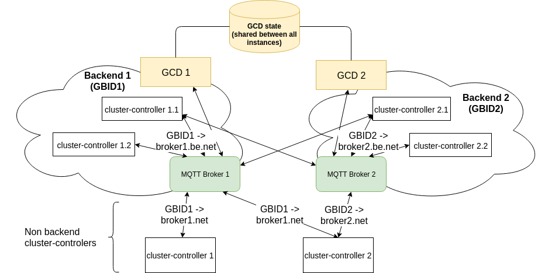

# joynr with multiple backends

## Overview

Joynr applications are clustered in two layers:
* **cluster-controller level:**
  * The smallest possible joynr network consists of a [cluster-controller](using_joynr.md#cluster-controller) and all joynr applications ([consumers/proxies](using_joynr.md#consumer) and [providers](using_joynr.md#provider)) connected to this cluster-controller. The applications are either standalone libjoynr runtimes connected to the cluster-controller via Web Sockets (local transport) or applications in the cluster-controller process itself (inprocess applications).
  * Multiple cluster-controllers can be connected via a global transport layer, either MQTT or HTTP Long Polling. Currently, only MQTT is fully supported.
* **global transport level:**
  * Originally, all cluster-controllers of a joynr network were connected to the same single [MQTT Broker](using_joynr.md#mqtt-broker) or HTTP Bounceproxy, no further clustering was possible.
  * Starting with joynr 1.11.0 (joynr 1.9.0 for Java only), cluster-controllers can be connected to an arbitrary number of MQTT Brokers, see also [Release Notes](ReleaseNotes.md).

## Abbreviations

* **BE**: Backend
* **CC**: ClusterController
* **DE**: DiscoveryEntry, See also **GDE** and **LDE**
* **GBID**: Global Backend IDentifier
* **GCD**: GlobalCapabilitiesDirectory
* **GDE**: GlobalDiscoveryEntry (type name: GlobalDiscoveryEntry)
* **LCD**: LocalCapabilitiesDirectory (part of **CC**)
* **LDE**: LocalDiscoveryEntry (type name: DiscoveryEntryWithMetaInfo)

## Backends

A joynr backend is identified by a Global Backend IDentifier (GBID) which abstracts the logical clustering from the transport specific details (MQTT Broker and MqttAddress in case of MQTT global transport). Internally, GBIDs are mapped to the real address of that backend's messaging server (broker), in case of MQTT: the MqttAddress of the backend's MQTT broker.

Backend and non backend applications cannot be clearly separated, except for the joynr internal global services (see the following section).  
A backend is rather a cluster of joynr applications (consumers and provider) communicating via the same global transport. Providers of a backend are registered for that backend at the [GlobalCapabilitiesDirectory](using_joynr.md#capabilities-discovery-directory) for the GBID of that backend. Consumers / proxies belong to the same backend as the providers they are communicating with. For MQTT, a backend (GBID) consists of all joynr participants (consumers and providers) which are connected to the same MQTT Broker, i.e. all participants that can be reached via this Broker. Multi homing is also possible, of course.

## joynr backend services (infrastructure) in multiple backends

Joynr needs a global backend service, the [GlobalCapabilitiesDirectory (GCD)](using_joynr.md#capabilities-discovery-directory), in order to dynamically discover globally registered providers connected to different cluster-controllers.

In a multiple backends environment, each backend has its own GCD instance, reachable only from within its own backend. All GCD instances of all backends share the same state, i.e. the information about globally registered providers and the backends (GBIDs) in which they are registered and reachable. With this shared state, a provider registered only for one backend can also be discovered via the GCD instances in all other backends as long as the consumer's CC is configured for the provider's backend.

Details about the GCD and its implementation are out of scope for this document. Joynr provides an example implementation of the GCD, see [joynr infrastructure documentation](infrastructure.md). For further details about the GCD and requirements for an implementation of that service, please refer to the internal documentation [GCD in multiple backends](../docs/gcd-in-multiple-be.md).

## CC (cluster-controller) configuration for multiple backends

A CC needs some additional configuration in order to be able to connect to multiple backends:
* GBIDs: the CC needs to know the GBID of each backend it shall establish a connection to.
  * Java: [PROPERTY_GBIDS](JavaSettings.md#property_gbids)
  * C\+\+:
    * first (default) GBID: `messaging/gbid`
    * additional GBIDs: `messaging/additional-backend-0-gbid`, `messaging/additional-backend-1-gbid`, etc
* Address (transport specific) for each configured GBID: internally the GBIDs are mapped to the transport specific address of the corresponding broker. In case of MQTT, a broker URI has to be configured for each GBID.

MQTT specific settings for multiple backends:
* broker URL: URL of the MQTT Broker
  * Java: [PROPERTY_MQTT_BROKER_URIS](JavaSettings.md#property_mqtt_broker_uris)
  * C\+\+:
    * first broker URL: `messaging/broker-url`
    * additional broker URLs: `messaging/additional-backend-0-broker-url`,
      `messaging/additional-backend-1-broker-url`, etc.
* keep alive interval (seconds) ***OPTIONAL, default=30***:
  * Java: [PROPERTY_KEY_MQTT_KEEP_ALIVE_TIMERS_SEC](JavaSettings.md#property_key_mqtt_keep_alive_timers_sec)
  * C\+\+:
    * setting for first broker: `messaging/mqtt-keep-alive-time-seconds`
    * additional brokers `messaging/additional-backend-0-mqtt-keep-alive-time-seconds`,
      `messaging/additional-backend-1-mqtt-keep-alive-time-seconds`, etc.
* connection timeout ***OPTIONAL, default=60***:
  * Java: [PROPERTY_KEY_MQTT_CONNECTION_TIMEOUTS_SEC](JavaSettings.md#property_key_mqtt_connection_timeouts_sec)
  * C\+\+:
    * setting for first broker: `messaging/mqtt-connection-timeout-ms`
    * additional brokers: `messaging/additional-backend-0-mqtt-connection-timeout-ms`,
      `messaging/additional-backend-1-mqtt-connection-timeout-ms`, etc.

## (Global) Provider registration with multiple backends

By default, a provider is registered in the default (first) backend (GBID), i.e. the BE identified by the first configured GBID at the CC.

A provider can also be registered easily (without knowledge about the available GBIDs) in all BEs (GBIDs) configured at the CC, by calling a special `registerInAllKnownBackends()` method.

In both cases, the global registration (for all GBIDs) is performed by the CC via the GCD instance in the CC's default BE, i.e. the BE of the first configured GBID.

To register a provider in different backends and/or via different JDS instances, a list of GBIDs has to be selected as parameter for the provider registration. The first selected GBID determines the GCD instance that will be used by the CC to perform the global registration.

Please refer to the language specific developer guides for further details on the provider registration:
* Java: [Java Developer Guide](wiki/java.md#building-a-java-provider-application)
* C\+\+: [C++ Developer Guide](wiki/cplusplus.md#registering-provider)
* Javascript: [JavaScript Developer Guide](wiki/javascript.md#building-a-javascript-provider-application)

## (Global) Proxy creation (discovery) with multiple backends

By default, a provider is looked up in all backends (GBIDs) known to the CC, i.e. all BEs configured at the CC.

The global lookup is performed by the CC via the GCD instance in the CC's default BE, i.e. the BE of the first configured GBID.

To discover a provider only in selected backends and/or via different JDS instances, a list of GBIDs has to be selected at the proxy builder. The first selected GBID determines the GCD instance that will be used by the CC to perform the global lookup.

Please refer to the language specific developer guides for further details on the proxy creation:
* Java: [Java Developer Guide](wiki/java.md#building-a-java-consumer-application)
* C\+\+: [C++ Developer Guide](wiki/cplusplus.md#creating-a-proxy)
* Javascript: [JavaScript Developer Guide](wiki/javascript.md#building-a-proxy)

## Mqtt Status Metrics for multiple backends (Java/JEE)

The joynr status metrics for MQTT (Java, JEE) are retrieved via the JoynrStatusMetrics interface.
There, you can call the method `getAllConnectionStatusMetrics()` or
`getConnectionStatusMetrics(gbid)` to retrieve up to two ConnectionStatusMetrics objects per GBID,
depending on whether separate sending and receiving connections are configured.  
See [Java Developer Guide](java.md#status_monitoring) for more information.

## Known limitations and issues of multiple backends support in joynr

### Diamond discovery

> Background:
> * ParticipantIds of providers and proxies in joynr must be unique in the whole joynr network.
> * To deliver messages to joynr participants (providers and proxies), the CC and the libjoynr runtime have a mapping between participantId and the transport specific address of the next hop to the participant.
> * In case of an MQTT address (the participant is connected to another CC), the BE's GBID is part of the address, i.e. a participant is contacted via the GBID of this address

I a provider is registered for multiple GBIDs, it can be discovered by a CC connected to the same GBIDs via any of these GBIDs.  
If one or multiple consumers connected to the same CC want to create a proxy for the same provider but via different GBIDs, first for `GBID1`, then for `GBID2`, the following happens:
1. The first global lookup for `GBID1` returns the GDE with the provider's address for the first GBID:
   * the provider's GDE is added to the global cache of the LCD
   * the provider's participantId is mapped to the provider's address for `GBID1` (routing entry)
   * a proxy for the provider's participantId is created for the consumer
2. The consumer can now use the proxy to communicate with the provider and the communication is performed via `GBID1`
3. The second lookup for `GBID2` returns the GDE with the provider's address for the seconds GBID:
   * the already cached GDE with address for `GBID1` is replaced by the GDE for `GBID2`
   * the provider's participantId is mapped to the provider's address for `GBID2`, replacing the old routing entry
   * another proxy for the provider's participantId is created for the consumer
4. The consumer(s) can use both proxies to communicate with the provider, but the communication for both proxies is performed via `GBID2`

**It is not possible for two consumers at the same CC to communicate with the same provider (participantId) via different backends (GBIDs)**
